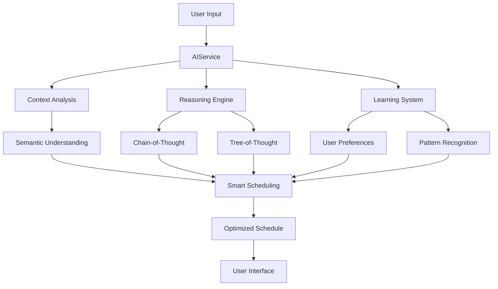

# 🚀 Tasklify - AI-Powered Productivity Suite

# [📱 App Store](https://apps.apple.com/app/tasklify) 

<div align="center">

**Transform your productivity with AI-driven task management, smart scheduling, and intelligent insights.**

[Features](#-features) • [Screenshots](#-screenshots) • [Installation](#-installation) • [Usage](#-usage) • [Architecture](#-architecture) • [Contributing](#-contributing)

</div>

---

## 🌟 Overview

Tasklify is a cutting-edge iOS productivity application that harnesses the power of artificial intelligence to revolutionize how you manage tasks, schedule your day, and boost productivity. With advanced AI integration through OpenRouter, intelligent scheduling algorithms, and comprehensive task management features, Tasklify adapts to your workflow and helps you achieve more.

### ✨ What Makes Tasklify Special

- 🧠 **AI-Powered Intelligence** - Advanced reasoning and learning capabilities
- 📅 **Smart Scheduling** - Automatic optimization based on your patterns
- 🎯 **Context-Aware** - Understands your preferences and adapts accordingly
- 🔄 **Seamless Integration** - Works with Apple Calendar and Google Calendar
- 📱 **Native iOS Experience** - Built with SwiftUI for optimal performance
- 🌐 **Offline Capable** - Core features work without internet connection

---

## 🚀 Features

### 🧠 AI Intelligence Engine
- **Advanced Reasoning**: Chain-of-thought and tree-of-thought reasoning for complex problem-solving
- **Contextual Understanding**: Semantic embedding-based context retrieval
- **Continuous Learning**: Adapts to your preferences and improves over time
- **Natural Language Processing**: Sophisticated text analysis and task parsing
- **Sentiment Analysis**: Understands the emotional context of your tasks

### 📊 Smart Scheduling System
- **Intelligent Prioritization**: AI-driven task prioritization based on urgency and importance
- **Optimal Time Allocation**: Determines the best time slots for different task types
- **Dynamic Rescheduling**: Automatically adjusts when unexpected events occur
- **Energy-Level Matching**: Matches tasks with your natural energy patterns
- **Focus Blocks**: Schedules dedicated deep work periods with strategic breaks

### 📱 Core Productivity Features
- **Task Management**: Create, organize, and track tasks with rich metadata
- **Smart Reminders**: Location-based and time-based intelligent reminders
- **Note Taking**: Comprehensive note-taking with folder organization
- **Calendar Integration**: Seamless sync with Apple Calendar and Google Calendar
- **Voice Input**: Speech-to-text functionality for quick task creation
- **Offline Mode**: Core features available without internet connection

### 🎨 User Experience
- **Modern UI/UX**: Beautiful SwiftUI interface with intuitive navigation
- **Customizable Themes**: Personalize your experience with multiple themes
- **Interactive Dashboard**: Real-time productivity metrics and insights
- **Widget Support**: iOS widgets for quick access to tasks and schedules
- **Tour System**: Comprehensive onboarding and feature discovery

### 🔧 Advanced Features
- **Developer Mode**: Advanced debugging and analytics tools
- **Performance Metrics**: Detailed productivity analytics and insights
- **Conflict Resolution**: Intelligent handling of scheduling conflicts
- **Multi-Device Sync**: Seamless synchronization across devices
- **Privacy-First**: Local processing with optional cloud features

---

## 📱 Screenshots

<div align="center">

| Dashboard | Smart Scheduling | AI Chat | Calendar Integration |
|-----------|------------------|---------|---------------------|
|  |  |  |  |

</div>

---

## 🛠 Installation

### Prerequisites
- **Xcode 15.0+**
- **iOS 15.0+**
- **Swift 5.7+**
- **macOS Monterey 12.0+**

### Setup Instructions

1. **Clone the Repository**
   ```bash
   git clone https://github.com/yourusername/tasklify.git
   cd tasklify
   ```

2. **Open in Xcode**
   ```bash
   open Tasklify.xcodeproj
   ```

3. **Configure Bundle Identifier**
   - Update the bundle identifier in project settings
   - Ensure it matches your Apple Developer account

4. **Set Up Dependencies**
   - The project uses native iOS frameworks
   - No external package managers required

5. **Configure AI Services** (Optional)
   - Add your OpenRouter API key to the configuration
   - Set up calendar permissions in Info.plist

6. **Build and Run**
   - Select your target device or simulator
   - Press `Cmd + R` to build and run

### Quick Start Scripts

We've included helpful scripts to streamline setup:

```bash
# Fix common build issues
./fix_bundle_identifier.sh

# Prepare for App Store submission
./prepare_for_submission.sh

# Update app display name
./update_app_display_name.sh
```

---

## 📖 Usage

### Getting Started

1. **Launch Tasklify** and complete the onboarding tour
2. **Grant Permissions** for calendar, location, and microphone access
3. **Create Your First Task** using the "+" button or voice input
4. **Enable AI Scheduling** to let Tasklify optimize your day
5. **Explore Features** using the comprehensive tour system

### Key Workflows

#### Creating Tasks
```swift
// Voice input supported
"Create a task to review quarterly reports by Friday"

// Or use the intuitive UI with rich metadata
Task(title: "Review Reports", priority: .high, deadline: Date())
```

#### AI-Powered Scheduling
- Navigate to **Smart Scheduling** tab
- Tap **Generate Schedule** for AI optimization
- Review and adjust the intelligent recommendations
- Enable **Auto-Reschedule** for dynamic adjustments

#### Calendar Integration
- Go to **Settings** → **Calendar Integration**
- Connect your Apple Calendar or Google Calendar
- Configure sync preferences and conflict resolution

---

## 🏗 Architecture

### Project Structure

```
Tasklify/
├── 📱 App/                    # App configuration and entry point
├── 🎨 Views/                  # SwiftUI views and UI components
│   ├── Components/            # Reusable UI components
│   ├── Settings/              # Settings and configuration views
│   └── Common/                # Shared view utilities
├── 🧠 Services/               # Core business logic and AI services
│   ├── AIService.swift        # Main AI integration service
│   ├── SmartSchedulerService.swift # Intelligent scheduling
│   └── CalendarService.swift  # Calendar integration
├── 📊 ViewModels/             # MVVM view models
├── 🗃 Models/                 # Data models and structures
├── 🔧 Utils/                  # Utility functions and extensions
├── 📦 Extensions/             # Swift extensions
└── 🎯 Intents/                # Siri Shortcuts and widgets
```

### AI Architecture



### Key Services

#### 🧠 AI Services
- **AIService**: Main AI coordination and OpenRouter integration
- **AIReasoningService**: Advanced reasoning capabilities
- **AILearningService**: Continuous learning and adaptation
- **AIContextualUnderstandingService**: Context-aware processing
- **AIEmbeddingService**: Semantic text understanding

#### 📅 Scheduling Services
- **SmartSchedulerService**: Intelligent task scheduling
- **CalendarService**: Calendar integration and sync
- **ReminderService**: Smart reminder management

#### 📊 Analytics Services
- **AIPredictivetAnalyticsService**: Productivity insights
- **PerformanceTrackingService**: Metrics and analytics

---

## 🔧 Configuration

### Environment Setup

Create a configuration file for your environment:

```swift
// Config.swift
struct Config {
    static let openRouterAPIKey = "your-api-key-here"
    static let enableAIFeatures = true
    static let enableAnalytics = true
    static let debugMode = false
}
```

### Customization Options

#### AI Behavior
```swift
// Customize AI reasoning depth
AIService.shared.reasoningDepth = .advanced

// Enable/disable learning
AIService.shared.learningEnabled = true

// Set context window size
AIService.shared.contextWindowSize = 1000
```

#### Scheduling Preferences
```swift
// Working hours
SmartSchedulerService.shared.workingHours = (9, 17)

// Break preferences
SmartSchedulerService.shared.breakDuration = 15 * 60 // 15 minutes

// Focus session length
SmartSchedulerService.shared.maxFocusSession = 90 * 60 // 90 minutes
```

---

## 🧪 Testing

### Running Tests

```bash
# Run all tests
xcodebuild test -scheme Tasklify -destination 'platform=iOS Simulator,name=iPhone 15'

# Run specific test suite
xcodebuild test -scheme Tasklify -only-testing:TasklifyTests/AIServiceTests
```

### Test Coverage

- **Unit Tests**: Core business logic and AI services
- **Integration Tests**: Calendar sync and data persistence
- **UI Tests**: Critical user workflows and accessibility
- **Performance Tests**: AI response times and memory usage

---

## 📈 Performance

### Optimization Features

- **Lazy Loading**: Views and data loaded on demand
- **Caching**: Intelligent caching of AI responses and user data
- **Background Processing**: Heavy computations performed off main thread
- **Memory Management**: Efficient memory usage with automatic cleanup
- **Battery Optimization**: Minimal background activity and smart sync

### Benchmarks

| Feature | Response Time | Memory Usage |
|---------|---------------|--------------|
| Task Creation | < 100ms | 2MB |
| AI Scheduling | < 2s | 5MB |
| Calendar Sync | < 500ms | 3MB |
| Voice Input | < 1s | 4MB |

---

## 🤝 Contributing

We welcome contributions from the community! Here's how you can help:

### Getting Started

1. **Fork the Repository**
2. **Create a Feature Branch**
   ```bash
   git checkout -b feature/amazing-feature
   ```
3. **Make Your Changes**
4. **Add Tests** for new functionality
5. **Submit a Pull Request**

### Contribution Guidelines

- Follow Swift style guidelines and conventions
- Write comprehensive tests for new features
- Update documentation for API changes
- Ensure all tests pass before submitting
- Use meaningful commit messages

### Areas for Contribution

- 🧠 **AI Enhancements**: Improve reasoning algorithms
- 🎨 **UI/UX**: Design improvements and accessibility
- 📊 **Analytics**: New productivity metrics and insights
- 🔧 **Performance**: Optimization and efficiency improvements
- 📚 **Documentation**: Tutorials and API documentation

---

## 📄 License

This project is licensed under the MIT License - see the [LICENSE](LICENSE) file for details.

---

## 🙏 Acknowledgments

- **OpenRouter** for AI model integration
- **Apple** for SwiftUI and iOS frameworks
- **Swift Community** for excellent tools and libraries
- **Contributors** who help make Tasklify better

---

## 📞 Support

### Getting Help

- 📖 **Documentation**: Check our comprehensive guides
- 💬 **Discussions**: Join our GitHub Discussions
- 🐛 **Issues**: Report bugs via GitHub Issues
- 📧 **Contact**: reach out for enterprise support


<div align="center">

**Made with ❤️ by Hamzeh Hijazi / Appify Labs**

[](https://github.com/yourusername/tasklify/stargazers)
[](https://github.com/yourusername/tasklify/network/members)
[](https://github.com/yourusername/tasklify/watchers)

</div> 
